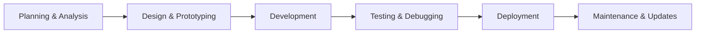

.png)


<div align="center">
  
</div>

<div align="center">
  
</div>

---

## 🚀 About Me

```javascript
const abdullahBoshir = {
  name: "Abdullah Boshir",
  role: "Fullstack Developer",
  location: "Cumilla, Chauttagram, Bangladesh",
  education: {
    mba: "MBA in Marketing (2023-2025)",
    bba: "BBA in Marketing (2017-2022)",
    institution: "Cumilla Victoria Govt. College (NU)"
  },
  courses: [
    "Next Level Web Development - Programming Hero (2024)",
    "Complete Web Development Course with Jhankar Mahbub - Programming Hero (2022)"
  ],
  passion: "Building scalable web applications with modern technologies",
  currentlyLearning: "Advanced React Patterns & Microservices",
  funFact: "I turn coffee into code ☕",
  philosophy: "I don't believe in declarations; I believe in delivering results that satisfy clients"
};
```

## 🛠️ Technical Skills

### Frontend Development


### Backend Development


### Design & Tools


## 📊 GitHub Stats

<div align="center">
  
  
  
</div>

<div align="center">
  
</div>

## 🏆 Featured Projects

### 🌍 Travel Buddy
A comprehensive tour services website with interactive features and modern UI.


**Key Features:**
- Interactive tour booking system
- Modern responsive UI with Tailwind CSS
- PostgreSQL database with Prisma ORM
- RESTful API with Node.js and Express.js
- JWT authentication and authorization
- Smooth user experience with performance optimization

**🔗 Links:**
- [Live Demo](https://travel-buddy-client-eight.vercel.app/)
- [Client Repository](https://github.com/abdullahboshir/Travel_buddy_client)
- [Server Repository](https://github.com/abdullahboshir/Travel_buddy_server)

---

### 🏠 Hall Management System
A full-featured web application for managing hall operations, users, and meal data with advanced admin control.


**Key Features:**
- Multi-role authentication (Student, Manager, Moderator, Admin, Super Admin)
- Role-based dashboards with different functionalities
- Real-time notifications and form management with Zod validation
- MUI DataGrid & DatePickers for enhanced user experience
- MongoDB with Mongoose for scalable data handling
- JWT-based authentication and role-based access control
- PDF generation and export functionality

**🔗 Links:**
- [Live Demo](https://hall-management-client.vercel.app/login)
- [Client Repository](https://github.com/abdullahboshir/Hall_management_client_updated)
- [Server Repository](https://github.com/abdullahboshir/Dining_management_server_updated)

---

### 🔧 Parts Zone
A clean and responsive car parts website designed for simple user experience.


**Key Features:**
- Clean and responsive design with Tailwind CSS
- Custom CSS for enhanced styling
- React Hook Form for form management
- React Router for navigation
- Minimal design while maintaining real-world structure
- Performance optimized backend with Node.js and Express.js

**🔗 Links:**
- [Live Demo](https://parts-zone.web.app/)
- [Client Repository](https://github.com/abdullahboshir/parts_zone_client)
- [Server Repository](https://github.com/abdullahboshir/parts_zone_server)

## 🎯 What I Do

- 🔧 **Fullstack Development**: Building complete web applications from frontend to backend
- 🎨 **UI/UX Design**: Creating intuitive and responsive user interfaces with modern design principles
- 🗄️ **Database Design**: Designing efficient database schemas with MongoDB and PostgreSQL
- 🚀 **Performance Optimization**: Optimizing applications for speed and scalability
- 🔒 **Security Implementation**: Implementing JWT authentication and role-based authorization
- 📱 **Responsive Design**: Ensuring applications work seamlessly across all devices
- 🎯 **Problem Solving**: Creative solutions for complex web development challenges

## 📈 My Development Process



## 🎓 Education & Certifications

### Academic Background
- **MBA in Marketing** (2023-2025) - Cumilla Victoria Govt. College (NU)
- **BBA in Marketing** (2017-2022) - Cumilla Victoria Govt. College (NU)

### Professional Development
- **Next Level Web Development** - Programming Hero (2024)
- **Complete Web Development Course** with Jhankar Mahbub - Programming Hero (2022)

## 🌟 Core Competencies

### Programming Languages
- **JavaScript/TypeScript**: Advanced proficiency in modern ES6+ features
- **HTML/CSS**: Expert level with responsive design principles
- **SQL**: Database querying and management

### Frameworks & Libraries
- **Frontend**: React.js, Next.js, Redux Toolkit, Material-UI, Bootstrap, DaisyUI
- **Backend**: Node.js, Express.js, Mongoose, Prisma
- **Database**: MongoDB, PostgreSQL
- **Styling**: Tailwind CSS, Custom CSS, Responsive Design
- **Forms**: React Hook Form with Zod validation

### Development Tools
- **Version Control**: Git, GitHub
- **Package Managers**: npm, yarn
- **API Testing**: Postman
- **Design Tools**: Figma, Adobe Photoshop, Adobe Illustrator
- **Deployment**: Vercel, Firebase

## 📫 Let's Connect

<div align="center">
  <a href="https://www.linkedin.com/in/abdullahboshir" target="_blank">
    
  </a>
  
  <a href="mailto:abdullahboshir@gmail.com">
    
  </a>
  
  <a href="https://abdullahboshir.vercel.app" target="_blank">
    
  </a>
  
  <a href="tel:+8801852141471">
    
  </a>
</div>

## 🎉 Fun Facts

- 🎮 I love playing with new technologies and building side projects
- ☕ Coffee is my fuel for coding sessions
- 📚 Always learning and exploring new frameworks and libraries
- 🌍 Passionate about creating solutions that make a difference
- 🎯 Goal: Contribute to open-source projects and help the developer community
- 💼 Background in Marketing gives me unique perspective on user experience

## 📊 Weekly Development Breakdown

```text
💻 This Week I Spent My Time On:
🟡 JavaScript/TypeScript  ████████████████████░░░░  80.0%
🟢 HTML/CSS               ████████░░░░░░░░░░░░░░░░  20.0%
🟠 React/Next.js          ████████████████████████ 100.0%
🔴 Node.js/Express         ████████████████████████ 100.0%
```

## 🌍 Languages

- **English**: Fluent
- **Hindi**: Conversational
- **Bengali**: Native

---

<div align="center">
  
</div>

<div align="center">
  
</div>

---

<div align="center">
  <sub>Made with ❤️ by Abdullah Boshir</sub>
</div>
