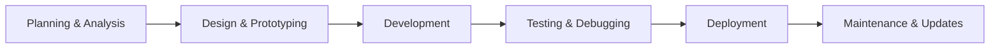

<!-- Optional Banner Image -->
.png)

<div align="center">
  
</div>

<div align="center">
  
</div>

---

## 🚀 About Me

```javascript
const abdullahBoshir = {
  name: "Abdullah Boshir",
  role: "Fullstack MERN Developer",
  location: "Bangladesh",
  passion: "Building scalable web applications",
  currentlyLearning: "Advanced React Patterns & Microservices",
  funFact: "I turn coffee into code ☕"
};
```

## 🛠️ Tech Stack

### Frontend


### Backend


### Tools & Others


## 📊 GitHub Stats

<div align="center">
  
  
  
</div>

<div align="center">
  
</div>

## 🏆 Featured Projects

### 🏠 Hall Management System
A comprehensive university hall dining management application built with Next.js, TypeScript, and Material-UI.


**Features:**
- Multi-role authentication (Student, Manager, Moderator, Admin, Super Admin)
- Role-based dashboards with different functionalities
- Real-time notifications and form management
- PDF generation and export functionality
- Responsive design with modern UI components

---

### 🛒 E-Commerce Platform
A full-featured e-commerce solution with payment integration and admin dashboard.


**Features:**
- User authentication and authorization
- Product catalog with search and filtering
- Shopping cart and checkout process
- Payment integration with Stripe
- Admin dashboard for inventory management

---

### 📱 Task Management App
A collaborative task management application with real-time updates.


**Features:**
- Real-time task updates and notifications
- Team collaboration and project management
- Drag-and-drop task organization
- Progress tracking and analytics

## 🎯 What I Do

- 🔧 **Fullstack Development**: Building complete web applications from frontend to backend
- 🎨 **UI/UX Design**: Creating intuitive and responsive user interfaces
- 🗄️ **Database Design**: Designing efficient database schemas and APIs
- 🚀 **Performance Optimization**: Optimizing applications for speed and scalability
- 🔒 **Security Implementation**: Implementing authentication and authorization systems
- 📱 **Responsive Design**: Ensuring applications work seamlessly across all devices

## 📈 My Development Process



## 🌟 Skills & Expertise

### Programming Languages
- **JavaScript/TypeScript**: Advanced proficiency
- **Python**: Intermediate level
- **HTML/CSS**: Expert level

### Frameworks & Libraries
- **Frontend**: React, Next.js, Redux, Material-UI, Tailwind CSS
- **Backend**: Node.js, Express.js, Mongoose
- **Database**: MongoDB, MySQL (basic)
- **Testing**: Jest, React Testing Library

### Development Tools
- **Version Control**: Git, GitHub
- **Package Managers**: npm, yarn
- **Build Tools**: Webpack, Vite
- **Deployment**: Vercel, Netlify, Heroku

## 📫 Let's Connect

<div align="center">
  <a href="https://linkedin.com/in/abdullahboshir" target="_blank">
    
  </a>
  
  <a href="mailto:abdullahboshir@email.com">
    
  </a>
  
  <a href="https://twitter.com/abdullahboshir" target="_blank">
    
  </a>
  
  <a href="https://abdullahboshir.dev" target="_blank">
    
  </a>
</div>

## 🎉 Fun Facts

- 🎮 I love playing with new technologies and building side projects
- ☕ Coffee is my fuel for coding sessions
- 📚 Always learning and exploring new frameworks
- 🌍 Passionate about creating solutions that make a difference
- 🎯 Goal: Contribute to open-source projects and help the developer community

## 📊 Weekly Development Breakdown

```text
💻 This Week I Spent My Time On:
🟡 JavaScript/TypeScript  ████████████████████░░░░  80.0%
🟢 HTML/CSS               ████████░░░░░░░░░░░░░░░░  20.0%
🟠 Python                 ████████████████████████ 100.0%
🔴 Other                   ████████████████████████ 100.0%
```

---

<div align="center">
  
</div>

<div align="center">
  
</div>

---

<div align="center">
  <sub>Made with ❤️ by Abdullah Boshir</sub>
</div>
